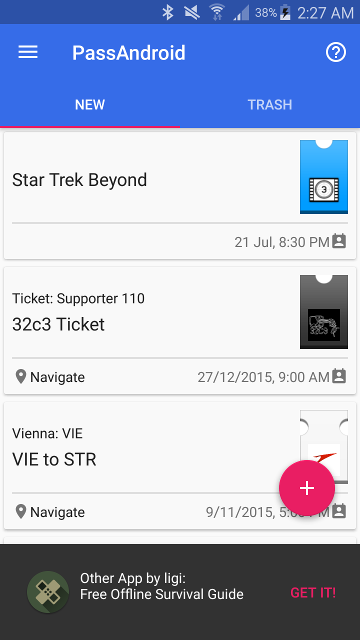

### What

Engage users with a Snackbar from the design lib to e.g. rate or translate the app.

### How

Get the dependency via JitPack: [](https://jitpack.io/#ligi/snackengage)

or from JCenter ( might be behind JitPack ) like this:
```groovy
compile "org.ligi:snackengage:$version"
```

Just add this where you want ( e.g. in the `onCreate` method of your entry activity )

```java
SnackEngage.from(this).withSnack(new DefaultRateSnack()).build().engageWhenAppropriate();
```

This would than show this snack after some opportunities and never again when once clicked on `Rate` ( which takes you to Play store or F-Droid - anything that accepts the generated `market://` link )


#### Other snacks that are possible:
 

or create your own snack - e.g. to make a survey.

combine them as you wish and add your own conditions:

```java
SnackEngage.from(view)
           .withSnack(new DefaultRateSnack())
           .withSnack(new GooglePlayOpenBetaTestSnack()
                              .withConditions(new NeverAgainWhenClickedOnce(),
                                              new AfterNumberOfOpportunities(42)))
           .withSnack(new TranslateSnack("https://www.transifex.com/projects/p/snackengage")
                              .withConditions(new IsOneOfTheseLocales(Locale.CANADA),
                              new NeverAgainWhenClickedOnce(),
                              new AfterNumberOfOpportunities(10)))

           .build()
           .engageWhenAppropriate();
```

### Why

This lib came to exist because I wanted something like [discreet-app-rate](https://github.com/PomepuyN/discreet-app-rate) - but using a Snackbar from the new material design support lib which was emerging at Google I/O 2015.
After thinking about it I wanted to make it more broad - not only for rating - also engaging users by pointing them to beta-testing and translation.

### Details

The DefaultRateSnack just configures a RateSnack with default conditions:

```java
public class DefaultRateSnack extends RateSnack {

    public DefaultRateSnack() {
        withConditions(new NeverAgainWhenClickedOnce(), new AfterNumberOfOpportunities(5));
    }

}
```

you can easily roll your own analog to this default one:

```java
public class AfterNumberOfOpportunities implements SnackCondition {

    private final int number;

    public  AfterNumberOfOpportunities(final int number) {
        this.number = number;
    }

    @Override
    public boolean isAppropriate(final SnackContext context, final Snack snack) {
        return context.getStats().getOpportunitiesSinceLastSnack() > number;
    }
}
```

you can also have a custom snack with an image added:



```java
.withSnack(new OpenURLSnack("market://details?id=org.ligi.survivalmanual", "survival") {

  @NonNull
  @Override
  protected Snackbar createSnackBar(final SnackContext snackContext) {
    Snackbar snackbar = super.createSnackBar(snackContext);
    final TextView textView = (TextView) snackbar.getView().findViewById(android.support.design.R.id.snackbar_text);
    textView.setCompoundDrawablesWithIntrinsicBounds(R.mipmap.survival, 0, 0, 0);
    textView.setCompoundDrawablePadding(getResources().getDimensionPixelOffset(R.dimen.rhythm));
    return snackbar;
  }
}.overrideTitleText("Other App by ligi:\nFree Offline Survival Guide")
 .overrideActionText("Get It!")
```

### Hints

If you use a FloatingActionButton inside a CoordinatorLayout from the design-lib and they are not coordinated - pass a view into snackengage from which the Snackbar can find the CoordinatorLayout - e.g. the fab:

```java
SnackEngage.from(fab)..;
```

So the movements between Snackbar and FAB are coordinated

### Methods

<a href="http://www.methodscount.com/?lib=org.ligi%3Asnackengage%3A0.5"></img></a>

### License
The MIT License (MIT)

Copyright (c) 2015/2016 ligi

Permission is hereby granted, free of charge, to any person obtaining a copy
of this software and associated documentation files (the "Software"), to deal
in the Software without restriction, including without limitation the rights
to use, copy, modify, merge, publish, distribute, sublicense, and/or sell
copies of the Software, and to permit persons to whom the Software is
furnished to do so, subject to the following conditions:

The above copyright notice and this permission notice shall be included in all
copies or substantial portions of the Software.

THE SOFTWARE IS PROVIDED "AS IS", WITHOUT WARRANTY OF ANY KIND, EXPRESS OR
IMPLIED, INCLUDING BUT NOT LIMITED TO THE WARRANTIES OF MERCHANTABILITY,
FITNESS FOR A PARTICULAR PURPOSE AND NONINFRINGEMENT. IN NO EVENT SHALL THE
AUTHORS OR COPYRIGHT HOLDERS BE LIABLE FOR ANY CLAIM, DAMAGES OR OTHER
LIABILITY, WHETHER IN AN ACTION OF CONTRACT, TORT OR OTHERWISE, ARISING FROM,
OUT OF OR IN CONNECTION WITH THE SOFTWARE OR THE USE OR OTHER DEALINGS IN THE
SOFTWARE.

